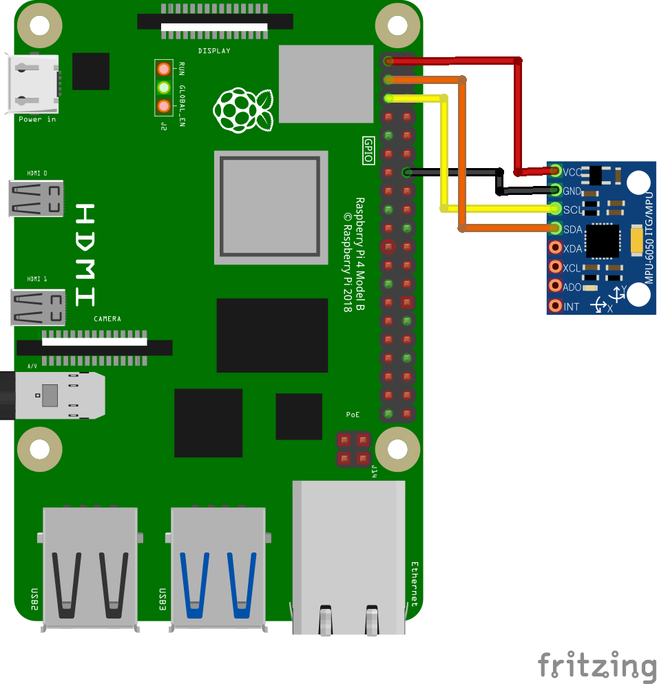

# mpu6050

MPU6050 IMU Driver Ros Package

This Package is for RaspberryPi

### Yotube Video

https://youtu.be/WxuLJZSJ7sk

### Diagram



### Dependency package
- [wiringPi](http://wiringpi.com/download-and-install/)

- [imu_msgs](https://github.com/PigeonSensei/pigeon_imu_driver/tree/master/imu_msgs)

### Run

**I2C communication must be enabled before execution**

```bash
roslaunch mpu6050 mpu6050.launch
```

**Caution : Leave the sensor stationary during calibration**

### Published Topics

- **imu/data** ([sensor_msgs/Imu](http://docs.ros.org/en/melodic/api/sensor_msgs/html/msg/Imu.html))

- **imu/angle** ([imu_msgs/Angle](https://github.com/PigeonSensei/pigeon_imu_driver/blob/master/imu_msgs/msg/Angle.msg))

### Services
- **reset_imu** ([mpu6050/ResetIMU](https://github.com/PigeonSensei/pigeon_imu_driver/blob/master/mpu6050/srv/ResetIMU.srv))

  -  **true** : Reset the IMU sensor


### Parameters

- ~ **AD0** (bool, default: false)

  AD0 pin status of mpu6050.
  
- ~ **PublishTF** (bool, default: true)

  Set whether to publish the TF 

- ~ **UseCalibration** (bool, default: true)

  Enable calibration

- ~ **CalibrationTimes** (int, default: 2000)

  Set the times of calibrations

- ~ **UseFilter** (bool, default: true)

  Enable Filter, The filter used is Madgwick filter

- ~ **FilterGain** (double, default: 0.031)

  Sets the beta gain of the Madgwick filter
  
- ~ **AccelerationScale** (int, default: 0)

  Acceleration sensor scale setting

  A larger scale increases the detection range but decreases the accuracy.

  - **0** : ±2g
  - **1** : ±4g
  - **2** : ±8g
  - **3** : ±16g
  - **others** : defult acceleration scale
  
- ~ **GyroScale** (int, default: 0)

  Gyro sensor scale setting

  A larger scale increases the detection range but decreases the accuracy.

  - **0** : ±250º/s
  - **1** : ±500º/s
  - **2** : ±1000º/s
  - **3** : ±2000º/s
  - **others** : defult Gyro scale
  
- ~ **Hz** (int, default: 60)

  Node's Hz setting

- ~ **ParentsFrameID** (string, default: base_link)

  Set parents frame's ID

- ~ **FrameID** (string, default: imu_link)

  Set frame's ID
  
### Reference

- [Estimation of IMU and MARG orientation using a gradient descent algorithm.   Sebastian O.H. Madgwick](https://www.researchgate.net/publication/221775760_Estimation_of_IMU_and_MARG_orientation_using_a_gradient_descent_algorithm)

